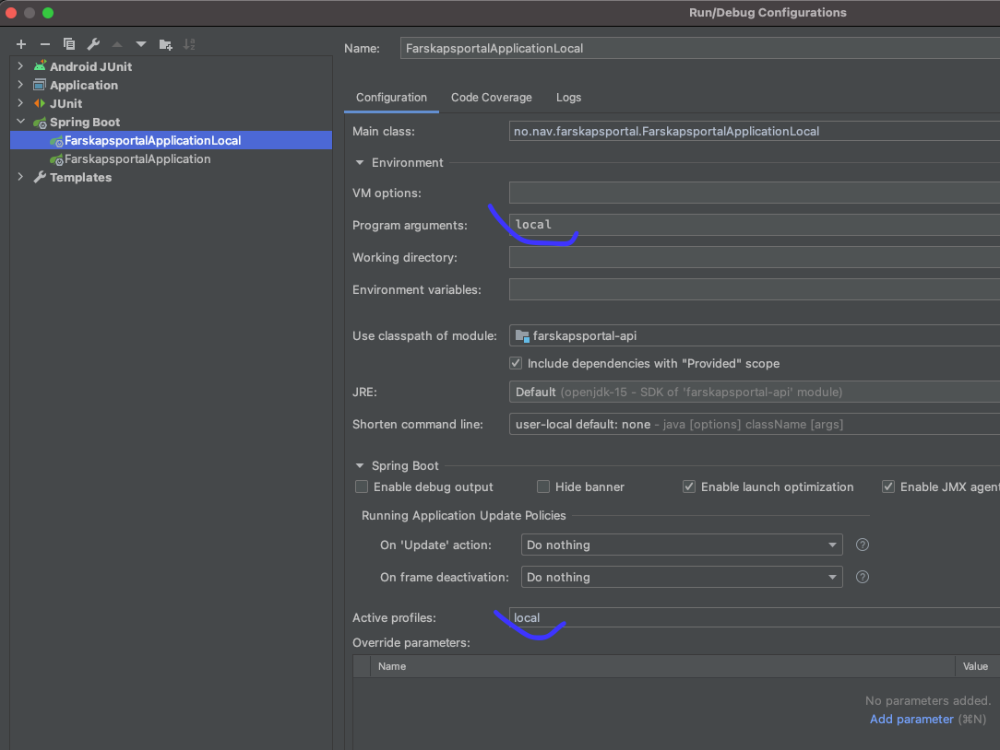

# farskapsportal-api

Støttefunksjoner for farskapsportal. Gjør oppslag mot PDL for å hente nødvendige personopplysninger i forbindelse med erklæring av farskap. Inneholder
også grenesnitt mot Skatt og Joark for lagring av ferdigstilte farskapserklæringer.

### hemmeligheter

Hemmeligheter lagres som kubernetes secrets i GCP namespace farskapsportal. Følgende er i bruk:

##### Secret name: farskapsportal-api-secret

- APIKEY_PDLAPI_FP: Api gateway-nøkkel for kommunikasjon mellom farskapsportal-api i GCP og pdl-api i FSS-sonen. Originalen ligger i Vault, dev-sti:
  https://vault.adeo.no/ui/vault/secrets/apikey/show/apigw/dev/pdl-api/farskapsportal-api_q1

- APIKEY_STS_FP: Api gateway-nøkkel for kommunikasjon mellom farskapsportal-api i GCP og security-token-service (STS) i FSS-sonen. Originalen ligger i
  Vault, dev-sti:
  https://vault.adeo.no/ui/vault/secrets/apikey/show/apigw/dev/security-token-service-token/farskapsportal-api_q1

- SRVFARSKAPSPORTAL_PWD: Passord til farskapsportalssystembruker. Denne brukes ved henting av token STS. Originalen ligger i Vault, dev-sti:  
  https://vault.adeo.no/ui/vault/secrets/serviceuser/show/dev/srvfarskapsportal

##### Secret name farskapsportal-api-aud

- AUD_FP: Angir gyldig publikum for farskapsportal-apis OIDC-token.

### testing av endepunkter

Endepunktene er dokumentert med Swagger, og kan testes lokalt og på GCP dev:

- LOKALT: http://localhost:8080/swagger-ui.html
- DEV: https://farskapsportal-api-feature.dev.nav.no/swagger-ui.html

### lokal kjøring

Ved lokal kjøring brukes Spring-boot-instansen FarskapsportalApplicationLocal. Denne er satt opp med token-supports test-token, og kjøres som standard
med Spring-profilen local (se application.yml). Local-profilen benytter Wiremock for eksterne avhengigheter (security-token-service, pdl-api, Skatt,
og Joark). Data til Wiremock-stubbene leses inn fra test/resources/stubs-mappa.

Testtoken for lokalprofilen hentes fra http://localhost:8080/jwt.

Swagger URL: http://localhost:8080/swagger-ui/index.html?configUrl=/v3/api-docs/swagger-config

##### Lese secret fra GCP ved lokal kjøring

For å sette GOOGLE_APPLICATION_CREDENTIALS for lokal kjøring, kjør følgende kommando i terminal med GCP SDK:

>gcloud auth login --update-adc

##### Lokal kjøring uten å lese secret fra GCP
Ved lokal kjøring må Secret Manager være skrudd av. Dette gjøres i bootstrap.yml ved at spring.cloud.gcp.secretmanager.enabled settes til false, og
gjelder alle profiler som ikke kjører på GCP (inkludert enhetstesting). For at dette skal fungere i Intellij, må active profiles settes i
Run/Debug-konfigen som vist i bildet under:

##### Simulere signering lokalt

Gjør et postkall mot signeringsendepunktet i EsigneringStubController for å simulere signering for en part:
 >curl -X POST http://localhost:8080/esignering/api/12345678910/direct/signature-jobs/1/redirect

Etter signering kan endepunktet for mottak av status_query_token etter redirect kalles med en hvilken som helst streng som token.

### Wiremock

Wiremock under enhetstesting for restcontroller og konsument-klassene. Ved enhetstesting (Spring-profil test), legges testdata inn via
WireMock.stubFor (e.g. PdlApiStub og StsStub).

Wiremock brukes også ved kjøring av local-profilen, da som selvstendig server. Testdata leses da inn fra test/resources/stubs.

### Lombok

Lombok-annoteringer brukes i utstrakt grad for å redusere behovet for kokeplate-kode. For å få Lombok @Value-annotering til å fungere sammen med
Jackson serialisering og deserialisering er det lagt til en egen konfig-fil, lombok.config, under prosjektets rot. Uten denne vil Jackson ikke finne
standard konstruktør, og gi feil "(no Creators, like default construct, exist)" ved kjøring. 
 

